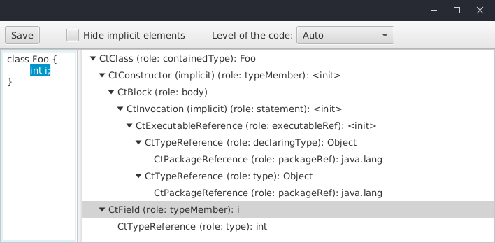
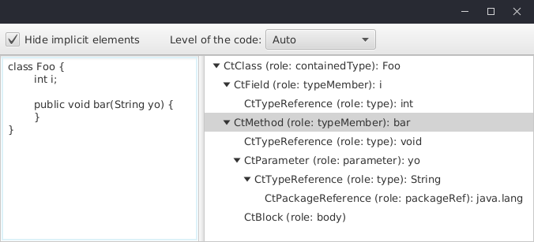
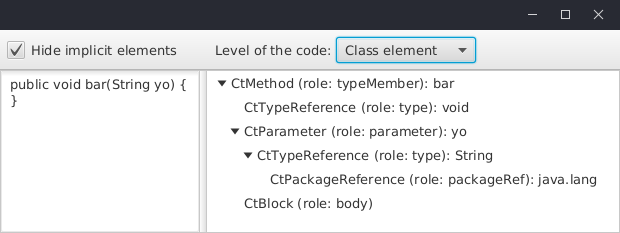
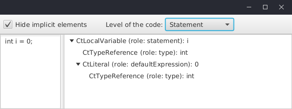
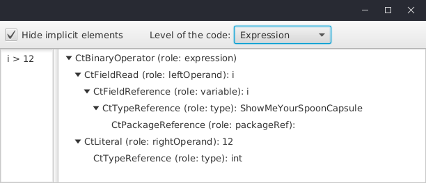

# ShowMeYourSpoon

A JavaFX app for visualising the Spoon tree of Java code (Java 11 supported).

An alternative to the native GUI support of Spoon ASTs with Spoon:

`$ java -cp spoon...-jar-with-dependencies.jar spoon.Launcher -i class.java --gui --noclasspath`

## Feature: selection highlighting and implicit elements masking

Put the code in the text area on the left.
The Spoon tree should then appear (if not maybe the code is not ok).

You can click on a tree element on the right to select the corresponding code (lines) on the left.
This does not work when the clicked tree item refers to a code element that does not have line position.

The checkbox in the toolbar masks or shows the Java implicit elements (printed with `'(implicit)'` in the tree view).

The button `Save` export the tree view of the current Java code in a text file.

You can also click in the code area to select the corresponding tree item.
On the next picture, the user clicked on `int`:

## Feature: analysis level

Users can set the analysis level: `auto`, `class element`, `statement`, `expression`.

The `auto` level tries to detect the level automatically by starting parsing the code as a Java class (then class element, etc.):

The `auto` level may fail, in particular with statements or expressions.
So users can define a specific level manually.

The `class element` level corresponds to fields, methods, etc., of a class:

The `statement` level corresponds to Java code statements:

The `expression` level corresponds to any Java expression:

## Feature: one argument to load a Java file

The app can take one argument: the path of a Java file to load.
  